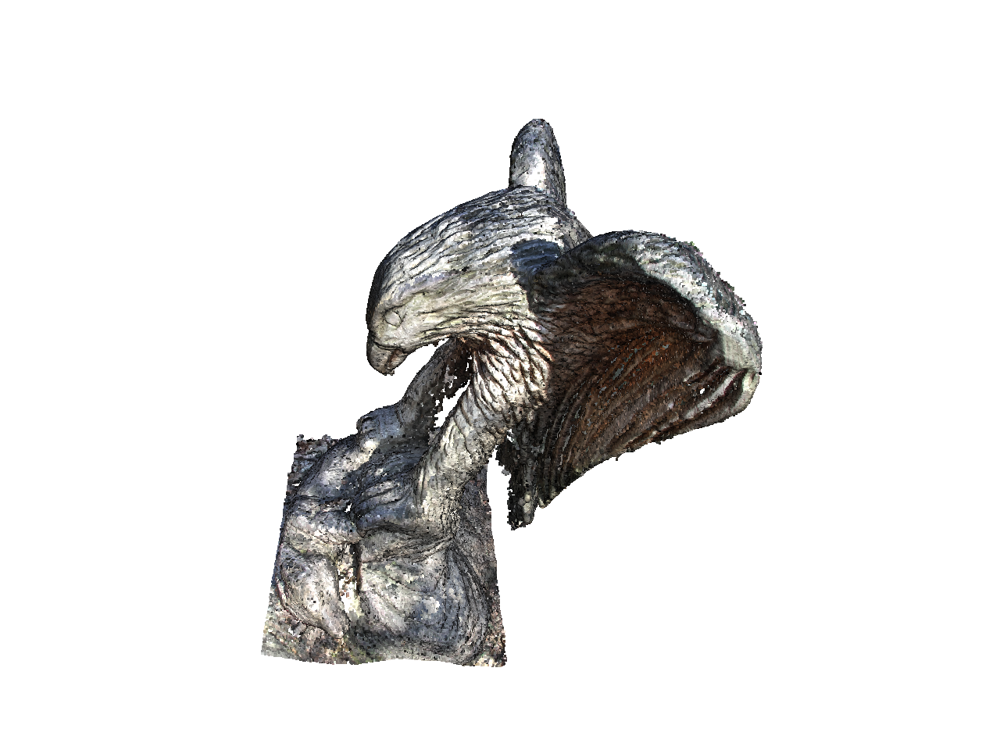
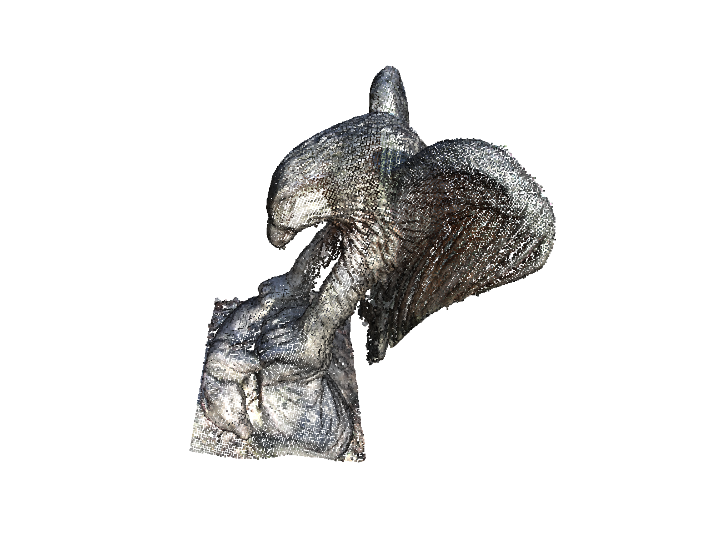
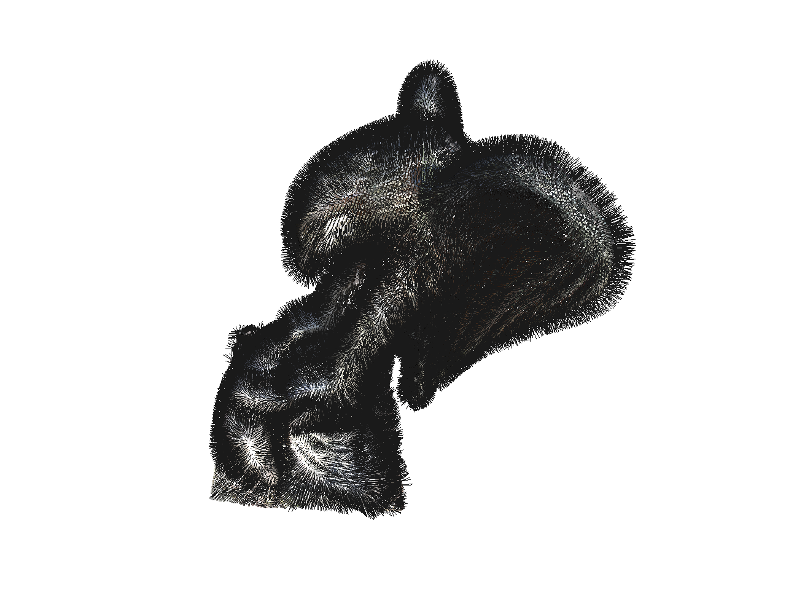
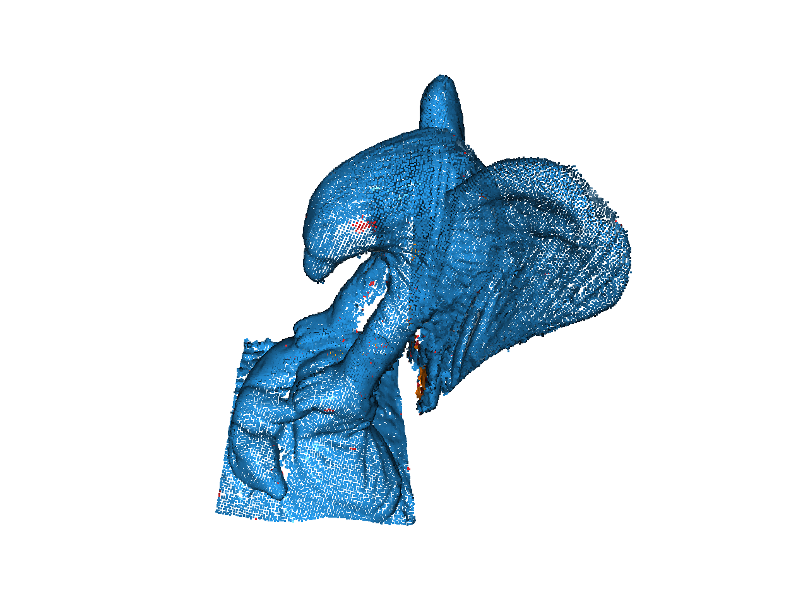
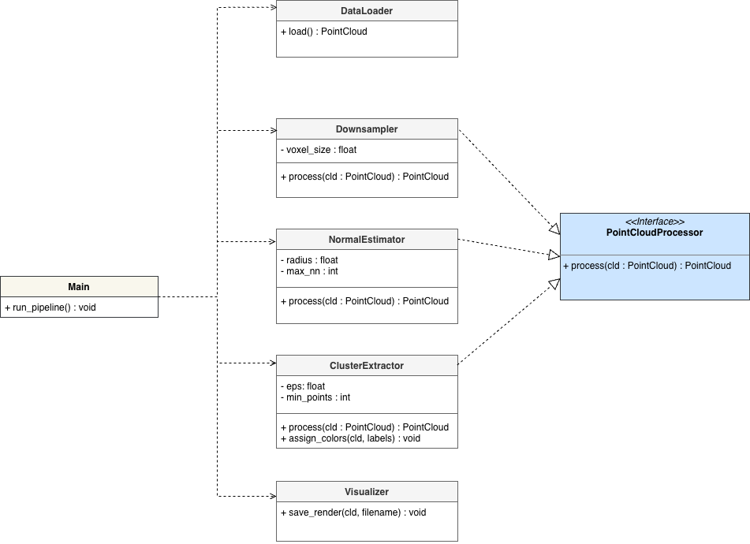
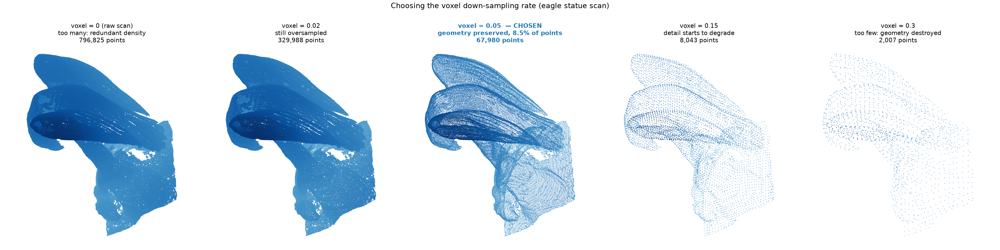
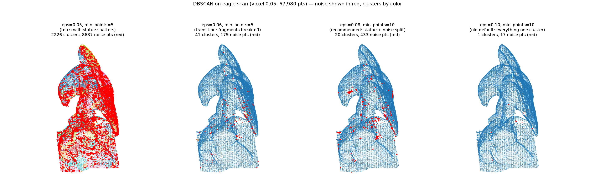
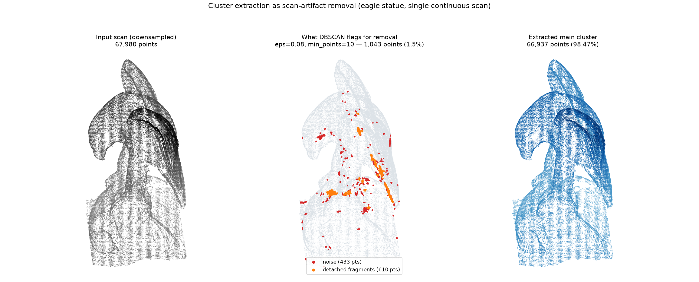

# Point Cloud Processing - Eagle Point Cloud Dataset

This repository contains the implementation of point cloud processing techniques using Open3D, and will explore how to best and most efficiently implement those techniques. The pipeline loads a raw scan (the Open3D eagle dataset), downsamples it, estimates surface normals, extracts clusters with DBSCAN, and saves a render of the point cloud after every stage.

## Setup

Requires Python 3.12 (this project has been tested on 3.12 only).

```bash
git clone https://github.com/esvar2004/augmentus_pointcloud.git
cd backend

python -m venv env
source env/bin/activate # Windows: env\Scripts\activate

pip install -r requirements.txt
```

The eagle point cloud is fetched automatically by Open3D on the first run, so no manual download is necessary.

## Running the Program

From `backend/`:

```bash
python main.py
```

Every pipeline parameter can be overridden from the command line. The defaults have been specified at the rates I determined to be optimal after analysis.

| Parameter | Default | Description |
| --- | --- | --- |
| `--downsampling` | `0.05` | Voxel size for down-sampling (larger values remove more points) |
| `--normal-radius` | `0.1` | Search radius for surface normal estimation |
| `--normal-max-nn` | `30` | Maximum neighbors considered for normal estimation |
| `--cluster-eps` | `0.08` | Maximum neighbor distance within a DBSCAN cluster |
| `--cluster-min-points` | `10` | Minimum points required to form a DBSCAN cluster |

To run the unit tests:

```bash
python -m pytest
```

## Pipeline Outputs

Running the program saves a render after each processing stage to `figures/results/`:

| Stage | Render |
| --- | --- |
| **1. Initial point cloud** — Raw Scan, 796,825 points |  |
| **2. Voxel downsampling** — voxel size 0.05, 67,980 points (8.5% of the original) |  |
| **3. Normal estimation** — hybrid KD-tree search, radius 0.1, max 30 neighbors |  |
| **4. Cluster extraction** — DBSCAN, eps 0.08, min_points 10; main cluster represented in blue, noise in red, small detached clusters in orange |  |

## Code Architecture - UML Class Diagram



```
backend/
├── main.py                        # Main — orchestrates the pipeline end to end
├── pipeline/
│   ├── point_cloud_processor.py   # PointCloudProcessor — abstract interface
│   ├── data_loader.py             # DataLoader — loads the input point cloud
│   ├── downsampling.py            # Downsampler — voxel grid down-sampling
│   ├── normal_estimation.py       # NormalEstimator — surface normal estimation
│   ├── cluster_extraction.py      # ClusterExtractor — DBSCAN clustering + coloring
│   └── visualizer.py              # Visualizer — saves renders to figures/results/
└── tests/                         # one test file per pipeline module
```

Each stage of the pipeline is explicitly designed to have a single responsibility. `Downsampler`, `NormalEstimator`, and `ClusterExtractor` all implement the `PointCloudProcessor` interface. The `process(cld) -> PointCloud` method has the same shape: cloud in, cloud out. `DataLoader` (source of the point cloud) and `Visualizer` (a rendering class) sit outside the interface deliberately. `Main` is the only class that orchestrates the entire pipeline by chaining `process` calls and handing each intermediate result to `Visualizer`.

## Parameter Selection

The pipeline defaults were chosen empirically on this dataset after performing empirical analysis using different values for the parameters.

- **Voxel size - 0.05** preserves the statue's geometrical shape at 8.5% of the original. The figure below shows the trade-off between geometrical preservation and efficient representation. The raw scan and voxel size 0.02 are visually indistinguishable while larger values visibly degrade, making it nearly impossible to ascertain the original structure.

  

- **DBSCAN eps - 0.08, min_points - 10** captures the middle ground between the two aggressive ends of Euclidean clustering on a single continuous scan. After voxel down-sampling at 0.05, the median nearest-neighbor spacing equals the voxel size, so connectivity is measured by the eps/voxel ratio: below ~1.2× the statue degrades into thousands of fragments, above ~2× everything merges all points into one cluster and nothing is filtered. min_points is bounded by the same geometry — a surface voxel downsampled at 0.05 has roughly &pi;&middot;(eps/voxel)&sup2; &asymp; 12 neighbors within eps = 0.08, so at min_points 20+, the entire cloud is classified as noise.

  

- **Euclidean clustering is tuned for noise removal, not semantic detection.** Since the scan is one continuous surface, DBSCAN cannot split it into semantic parts (that would require a different algorithmic approach like normals-based region growing); however, Euclidean clustering can isolate the points not attached to the statue. At the chosen parameters, it keeps 98.5% of the points as one coherent cluster while flagging 1,043 points of scan noise and detached fragments:

  

## Extensibility

The architecture is designed such that future changes don't disrupt the entire pipeline and are self-contained.

- **Adding a pipeline stage** requires writing one new `PointCloudProcessor` subclass and adding one `process` + `save_render` pair to `Main.run_pipeline`.
- **Tuning parameters** requires no code changes at all — every stage parameter is exposed as a CLI flag, which is how the values above were explored before becoming defaults.
- **Swapping the dataset** only touches `DataLoader.load()`; everything downstream is source-agnostic.
- **Testing follows the structure**: each module has its own test file with concrete assertions, so a new stage brings its own `tests/test_<module>.py` without interfering with existing tests.
